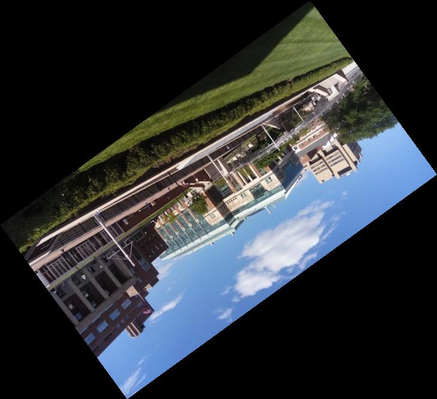

# Lin, Yi-Jheng <span style="color:red">(102061129)</span>

# Project 0 / Pixel array manipulation

## Overview
The project is related to 
> 
> * Image file input/output.
* Pixel array manipulation, ex: grey scale, image flip, rotation.

## Implementation

## Part 0. Grey Scale

### Goals
> Converting a colored image to grey scaled one by setting intensity 
	> Y = 0.299*R + 0.587*G + 0.114*B  for each pixel.  


### Results

<center>


<br>
Original Images: Source Image (Left); My Image (Right)
<br>


<br>
grey-scale images
<br>
</center>

## Part 1. Image Flipping

### Goals
> Write a MATLAB  program to flip the image in three way:  
> 
* horizontal flipping (type ==0)
* vertical flipping (type ==1)
* horizontal + vertical flipping (type ==2).

### Procedures
1. Input arguments are: image I, and selecting type

2. Initial r, g, b array for flipped image. Note that we do type conversion.
	```
	R_flip =  uint8(zeros(height,width));
	G_flip =  uint8(zeros(height,width));
	B_flip =  uint8(zeros(height,width));
	```
3. Using "if statement" to choose the type and then complete the function. Take type==0 (horizontal flipping) for example:
```
%% horizontal flipping
if type==0
   for h = 1 : height
       for w = 1 : width 
            R_flip(h, w) = R(h,width-w+1);
            G_flip(h, w) = G(h,width-w+1);
            B_flip(h, w) = B(h,width-w+1);
       end
   end
```
By using nested for loop, we assign pixels from R, G, B to R_flip, G_flip, B_flip respectively. Above codes flips pixels horizontally, and store the result in X_flip, where X = R, G, and B.

The function returns X_flips as an output image:
```
I_flip(:,:,1) =  R_flip;
I_flip(:,:,2) =  G_flip;
I_flip(:,:,3) =  B_flip;
```

### Results

<center>


<br>
Horizontal Flipping
<br>


<br>
Vertical Flipping
<br>


<br>
Both Horizontal and Vertical Flipping
<br>
</center>


## Part 2. Image Rotation

### Goals
> Rotate the image from original one. I try to rotate the image in 3 different angles:
> 
> * 45 deg or pi/4 rad
> * 90 deg or pi/2 rad
> * 144 deg or 4pi/5 rad

### Procedures
1. Input argument are: image I, and the angle we want to rotate with.
2. Record image vertex, and use rotation matrix to get new vertex.

	```
	matrix = [cos(radius), -sin(radius) ; sin(radius), cos(radius)];
	% Rotate the four vertices
	vertex(1,:)=[0,0]; 				% upper left corner
	vertex(2,:)=[width-1,0]; 		% upper right corner
	vertex(3,:)=[0,height-1]; 		% lower left corner
	vertex(4,:)=[width-1,height-1]; % lower right corner
	% rotate the coner
	vertex_new(1,:) = vertex(1,:)*transpose(matrix);
	vertex_new(2,:) = vertex(2,:)*transpose(matrix);
	vertex_new(3,:) = vertex(3,:)*transpose(matrix);
	vertex_new(4,:) = vertex(4,:)*transpose(matrix);

	```
Note that we need to convert the matrix index into coordinate system, and entry (1,1) (i.e., the upper left corner pixel ) should be set as point (0,0) in coordinate system because it is the center of rotation.

3.	Using MATLAB functions "min()" & "max()"  to find both the minimum and maximum point of x and y. Furthermore, record how much we move the rotated figure to the positive axis (the first quadrant).
	```
	minx= min(vertex_new(:,1));
	miny= min(vertex_new(:,2));
	maxx= max(vertex_new(:,1));
	maxy= max(vertex_new(:,2));

	x_shift = -minx;
	y_shift = -miny;
	```
4.  Calculate new width and height, and using function "ceil()" & "floor() to make sure they are an integer. Then we can create an new image.
	```
	 width_new = floor(maxx - minx)+1;
	 height_new = floor(maxy -miny)+1;
	
	 R_rot = zeros(width_new,height_new);
	 G_rot = zeros(width_new,height_new);
	 B_rot = zeros(width_new,height_new);
	```
5. Following, we do back-warping by using bilinear interpolation for each pixel on the rotation image, and find the corresponding r, g, b values from the original image.
	```    
	wa = (x_old-x1)/ (x2-x1);
	wb = (y_old-y1)/ (y2-y1);
	      
	w1 = (1-wa)*(1-wb);
	w2 = wa*(1-wb);
	w3 = wa*wb;
	w4 = (1-wa)*wb;
	            
	r=I(y1,x1,1)*w1 + I(y1,x2,1)*w2 +I(y2,x2,1)*w3 + I(y2,x1,1)*w4;
	g=I(y1,x1,2)*w1 + I(y1,x2,2)*w2 +I(y2,x2,2)*w3 + I(y2,x1,2)*w4;
	b=I(y1,x1,3)*w1 + I(y1,x2,3)*w2 +I(y2,x2,3)*w3 + I(y2,x1,3)*w4;
	```
Note that when ceil(.) = flooe(.), we directly assign wa or wb be zero. Moreover, set the color black if the back-warping pixel is outside the original image.

6. Finally, return the result.

### Results


<center>


<br>
Rotate by 45 Deg or Pi/4 rad
<br>


<br>
Rotate by 90 Deg or Pi/2 rad
<br>


<br>
Rotate by 144 Deg or 4*Pi/5 rad
<br>


</center>


## Discussions
In this lab, I realized that data types are important when processing the image. The original image store the data with type unsigned integer (unit 8), whose range is from 0 to 255. It is okay to remain this data type while doing this lab. However, when we create a new image by function zeros(), the data might be double, whose value range of image is from 0 to one rather than 0 to 255. That is why I convert double type back to uint8 in my code.  
